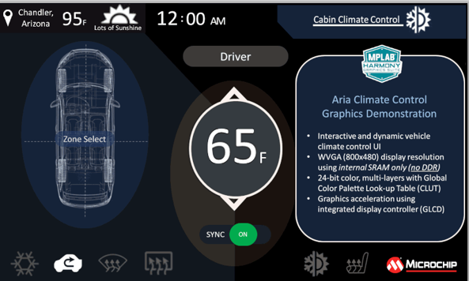

---
parent: Example Applications
title: Legato Climate Control
nav_order: 1
---

# Legato Climate Control

This demonstration emulates an interactive, touch-enabled vehicle climate control User Interface (UI).

|MPLABX Configuration|Board Configuration|
|:-------------------|:------------------|
| [legato_cc_mzda_cu_tm5000.X](legato_cc_mzda_cu_tm5000_X.html)| Curiosity PIC32MZ DA 2.0 Development Board using GLCD peripheral display controller to drive the [High-Performance WVGA LCD Display Module with maXTouch ® Technology](https://www.microchip.com/DevelopmentTools/ProductDetails/PartNO/AC320005-4)|