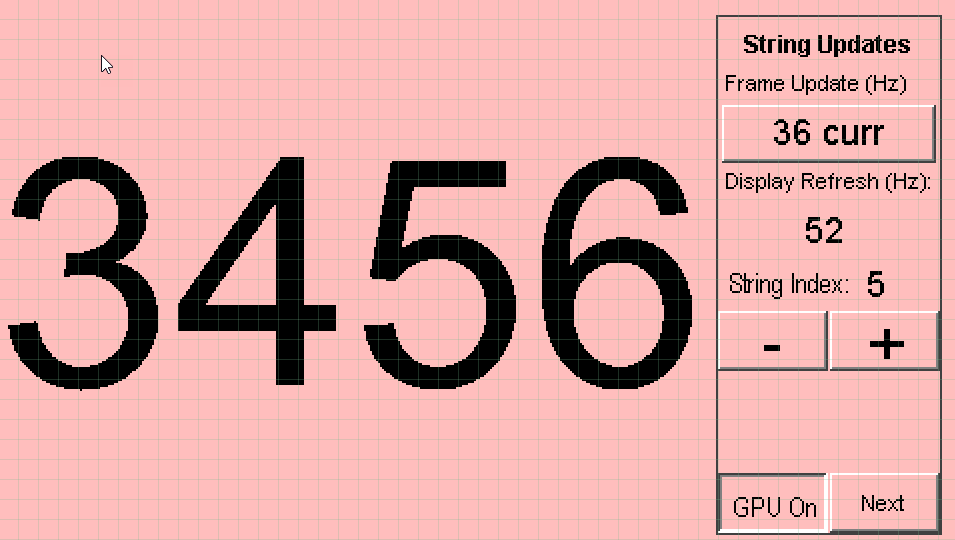
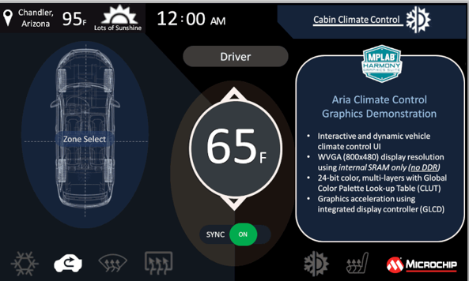
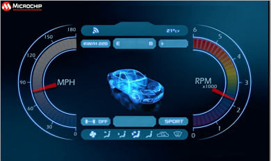

# Example Applications

The following applications are provided to demonstrate both basic and advanced Graphics capabilities of the SAM E70 Family.

## Legato Library Examples 

* [Legato Benchmark](./legato_benchmark/readme.md)

This application shows the frame update rates for various operations in the Legato Graphics Library, including string rendering, area fills and image decode and rendering. 

* [Legato Climate Control](./legato_climate_control/readme.md)

This demonstration emulates an interactive, touch-enabled vehicle climate control User Interface (UI).

* [Legato Dashboard](./legato_dashboard/readme.md)

This application presents a vehicle dashboard User Interface (UI). 

* [Legato Quickstart](./legato_quickstart/readme.md)

This demonstration provides a touch-enabled starting point for the legato graphics library.

* [Legato Quickstart External Resources](./legato_quickstart_ext_res/readme.md)

This application demonstrates how to use the Legato Graphics Library to retrieve externally stored assets.

* [Legato Video Player](./legato_video_player/readme.md)

This application demonstrates RAW Video Playback from External FAT32 Media

## Blank Library Examples

* [Blank Quickstart](./blank_quickstart/readme.md)

This demonstration provides a starting point to integrate a third-party graphics library with MPLAB Harmony Graphics Suite.

